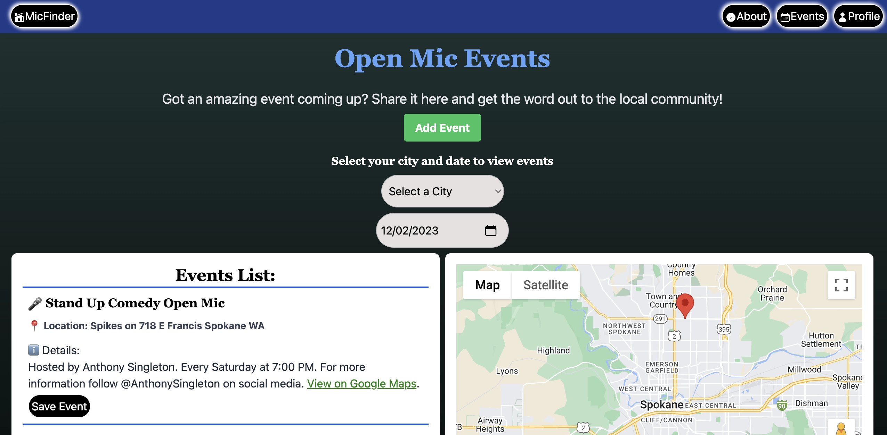

Welcome to the official repository for MicFinder, the ultimate platform for stand-up comedians, musicians, poets, and artists to discover open mic events. Leveraging the power of TypeScript and Firebase, MicFinder connects you to a world of live performances and open mic opportunities in your city.

## About MicFinder

MicFinder is designed to bridge the gap between artists and venues, facilitating the discovery of open mic events across various genres. Our platform not only allows users to find events but also to advertise their own, increasing visibility and audience engagement.

## Our Mission

- Connecting Talent: Linking aspiring artists with venues to showcase their talent.
- Event Discovery: Making it easier to find open mic events in your locality.
- Community Building: Fostering a community of artists, comedians, musicians, and enthusiasts.

## Technical Stack & Dependencies

MicFinder is built on a solid foundation of modern web technologies, detailed in our `package.json` file.

## Deployment and Updates

MicFinder is constantly evolving, with new features and updates aimed at enhancing user experience and connectivity. Keep an eye on our site for the latest in open mic events and platform features.

Thank you for exploring MicFinder. For the latest news and updates, visit [MicFinder](https://micfinder-fb06f.web.app/).

Credits and Acknowledgments

Thanks to the TypeScript community, Firebase team, and Google Cloud Platform for their invaluable resources. Special shoutout to @heroicons/react for their high-quality SVG icons, enhancing our UI design.

_Crafted with care by Nate Wright_
